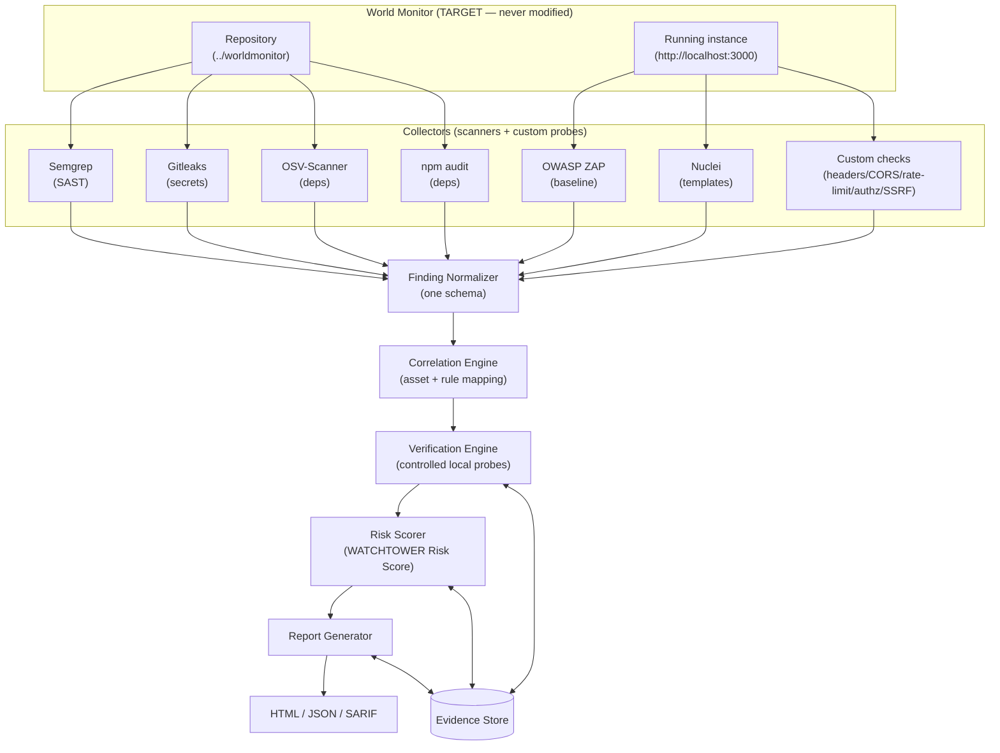

# 02 — Proposed Solution

## 2.1 Purpose

WATCHTOWER is an **automated, repeatable, evidence-backed security-assessment pipeline**
built specifically to assess World Monitor. It orchestrates established open-source
security tools, then adds the layer those tools lack: it **normalises** their output into
one schema, **correlates** findings that describe the same issue, **verifies** suspected
vulnerabilities with controlled local probes, **scores** them with a transparent model,
and **reports** with the supporting evidence attached.

WATCHTOWER is explicitly **not**:

- an antivirus, firewall, EDR, or WAF;
- a real-time protection or runtime-defence system;
- an automated exploitation or attack framework;
- a "zero-day detector" or a claim of "complete security coverage".

It is an assessment tool. It runs, produces a report, and exits.

## 2.2 Core Concept

The organising principle is a **finding lifecycle**. A signal from any single tool enters
as a *hypothesis* and is only promoted toward "confirmed" as independent evidence
accumulates:

```
Suspected  →  Correlated  →  Verified
                    ↘ False Positive
                    ↘ Needs Manual Review
```

- **Suspected** — a single source reported it. No corroboration yet.
- **Correlated** — two or more independent sources point at the same asset/issue.
- **Verified** — a controlled probe demonstrated the actual security property.
- **False Positive** — evidence shows the finding does not hold.
- **Needs Manual Review** — cannot be auto-verified; a human must decide.

**Correlation is not verification.** Two scanners agreeing raises confidence and priority,
but only a verification probe that exercises the real behaviour can move a finding to
*Verified*. This distinction is the heart of WATCHTOWER (see
[10-verification-model.md](10-verification-model.md)).

## 2.3 End-to-End Workflow

WATCHTOWER runs a fixed pipeline. Each stage has one job and hands a well-defined
artefact to the next:

```
DISCOVER → SCAN → NORMALIZE → CORRELATE → VERIFY → SCORE → REPORT
```

| Stage | Input | Output |
|-------|-------|--------|
| **Discover** | repo path + target URL | asset inventory (routes, files, deps, config) |
| **Scan** | assets | raw tool output (Semgrep, Gitleaks, OSV, npm audit, ZAP, Nuclei, custom probes) |
| **Normalize** | raw tool output | normalised findings in one schema (`Suspected`) |
| **Correlate** | normalised findings | correlated finding groups (`Correlated`) |
| **Verify** | correlated groups | verified/false-positive verdicts + evidence |
| **Score** | verified findings | WATCHTOWER Risk Scores + ranking |
| **Report** | scored findings + evidence | HTML + JSON + SARIF |

## 2.4 Data-Flow Diagram



## 2.5 What Differentiates WATCHTOWER From "Running Scanners"

| Concern | Plain scanners | WATCHTOWER |
|---------|----------------|-----------|
| Output format | N different schemas | one normalised finding schema (SARIF-compatible) |
| Duplicate signals | repeated across tools | correlated into single grouped findings |
| Confidence | flat "scanner said so" | staged lifecycle (Suspected→Correlated→Verified) |
| Truth of a finding | assumed | demonstrated by a controlled probe or marked for review |
| Prioritisation | tool-specific severities | one transparent WATCHTOWER Risk Score |
| Evidence | a log line | preserved artefacts + status rationale |
| App-specific risk | generic rules only | custom World Monitor probes (MCP/RSS/relay/desktop-aware) |
| Reproducibility | ad-hoc | one command, deterministic stages |

## 2.6 Verification-First Philosophy

The default posture is skepticism toward tool output. Concretely:

- A scanner match **never** auto-promotes to a confirmed vulnerability.
- Verification probes are **controlled, local, and non-destructive** — e.g. SSRF is
  verified only against a **local canary HTTP server we control**, never against cloud
  metadata endpoints or third-party infrastructure (see
  [07-security-assessment-methodology.md](07-security-assessment-methodology.md)).
- If a finding cannot be safely or automatically verified, it is labelled
  **Needs Manual Review** rather than being silently up- or down-graded.

## 2.7 Evidence-Backed Findings

Every finding carries an `evidence` block and a `verification` block (see
[08-finding-schema.md](08-finding-schema.md)). Evidence includes the originating tool
output, correlation links, and — for verified findings — the probe request/response or
artefact that demonstrates the property. The report is therefore auditable: a reader can
trace each score back to the reason it was assigned.

## 2.8 Relationship To The Target

World Monitor is the **target**, assessed read-only. WATCHTOWER lives in a **separate
project directory** and never writes to or modifies the World Monitor source. The
conceptual invocation is:

```bash
python watchtower.py --repo ../worldmonitor --target http://localhost:3000
```

See [05-tech-stack.md](05-tech-stack.md) for the toolchain and
[12-prototype-scope.md](12-prototype-scope.md) for exactly what the first prototype builds.

