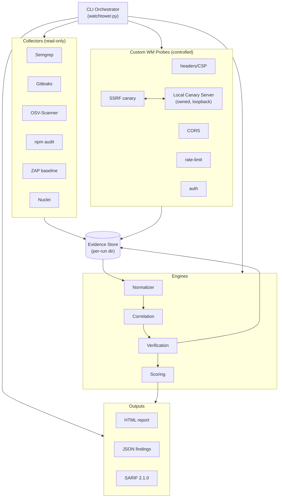

# 03 — System Architecture

This document describes **WATCHTOWER's own architecture** — the components that make up the
assessment tool and how data flows between them. It is not a description of World Monitor;
World Monitor is the **target** the architecture points at (read-only repo + a locally
running instance). See [11-world-monitor-attack-surface.md](11-world-monitor-attack-surface.md)
for the target's components.

Everything here describes the **prototype design** from
[12-prototype-scope.md](12-prototype-scope.md). Nothing in this repository is a running
system yet; this is the blueprint the prototype implements.

## 3.1 Design Shape

WATCHTOWER is a **single-machine, CLI-driven pipeline**. One command walks a fixed
sequence of phases, and each phase hands a well-defined artefact to the next:

```
DISCOVER → SCAN → NORMALIZE → CORRELATE → VERIFY → SCORE → REPORT
```

There is no daemon, no database, and no network service in the prototype. State lives in a
per-run **evidence store** directory on disk, which makes every run self-contained and
reproducible.

## 3.2 Component Map



## 3.3 Components

| Component | Responsibility | Reads | Writes |
|-----------|----------------|-------|--------|
| **CLI Orchestrator** (`watchtower.py`) | Parse args, load config, sequence phases, skip unavailable collectors gracefully, own the run directory. | CLI args, config | Run manifest, logs |
| **Collector adapters** | Wrap each external tool as a subprocess, capture its raw output verbatim. One adapter per tool. | Target repo / running target | Raw tool output → evidence store |
| **Custom probes** | The five World Monitor checks. Both *collect* signals and *verify* them under control. | Running target (HTTP), canary | Probe request/response artefacts |
| **Local canary server** | An HTTP listener WATCHTOWER owns, bound to loopback, used only for SSRF verification. | — | Canary hit log |
| **Normalizer** | Convert every collector/probe output into the common finding schema. | Evidence store raw output | Normalised findings (`suspected`) |
| **Correlation engine** | Group findings by asset/rule/location; promote corroborated ones to `correlated`. | Normalised findings | Correlated findings |
| **Verification engine** | Run the controlled probes, assign `verified` / `false_positive` / `needs_manual_review`, attach evidence. | Correlated findings, target, canary | Verdicts + artefacts |
| **Scoring engine** | Compute the WATCHTOWER Risk Score for each finding. | Verified findings | Scored findings |
| **Report generators** | Emit HTML, JSON, and SARIF from the final finding set. | Scored findings | Reports |
| **Evidence store** | The per-run directory that holds raw output, probe artefacts, and the final finding set. | — | Everything above |

The **collector adapters** and the **normalizer** are the extensibility seam: adding a new
tool means adding one adapter plus one normaliser mapping, and nothing downstream changes
because everything speaks the [common finding schema](08-finding-schema.md).

## 3.4 Proposed Module Layout

This is the intended layout for the prototype (**not yet built** — see
[12-prototype-scope.md](12-prototype-scope.md)):

```
watchtower/
├── watchtower.py              # CLI entry point
├── watchtower/                # package
│   ├── orchestrator.py        # phase sequencing
│   ├── config.py              # run config, tool paths, target/repo
│   ├── collectors/            # one adapter per external tool
│   │   ├── base.py            # Collector interface + subprocess helpers
│   │   ├── semgrep.py  gitleaks.py  osv_scanner.py
│   │   └── npm_audit.py  zap.py  nuclei.py
│   ├── probes/                # the five custom WM checks
│   │   ├── headers_csp.py  cors.py  rate_limit.py  auth.py
│   │   ├── ssrf_canary.py
│   │   └── canary_server.py   # loopback-bound canary listener
│   ├── engine/
│   │   ├── normalizer.py  correlation.py  verification.py  scoring.py
│   ├── schema/finding.py      # the normalised finding dataclass
│   └── report/
│       ├── html.py  json_out.py  sarif.py
│       └── templates/         # Jinja2 HTML templates
├── docs/                      # this documentation set
├── evidence/                  # per-run output dirs (git-ignored)
└── README.md
```

## 3.5 The Evidence Store

Every run creates a timestamped directory, e.g. `evidence/run-2026-09-28T00-00-00Z/`,
containing:

```
run-<timestamp>/
├── manifest.json          # what ran, tool versions, target, repo commit, skipped tools
├── raw/                   # verbatim collector output (semgrep.json, zap.json, …)
├── probes/                # per-probe request/response + canary logs
├── findings.json          # the final normalised, scored finding set
├── report.html            # human report
└── report.sarif           # SARIF 2.1.0
```

The store is the **single source of truth** for a run. Reports are derived from it, and it
is what makes a finding auditable: every `verified` verdict points at an artefact in
`probes/`, and every `suspected` finding points at raw output in `raw/`.

## 3.6 Architectural Boundaries (non-negotiable)

These boundaries are what keep WATCHTOWER a safe, honest assessment tool:

1. **Read-only on the repo.** The `--repo` path is only ever read. WATCHTOWER writes
   nothing into World Monitor's tree.
2. **Controlled on the target.** The `--target` is exercised with bounded, scripted
   requests only — never floods, never destructive payloads (see
   [10-verification-model.md](10-verification-model.md)).
3. **Local-first canary.** SSRF verification uses only the loopback-bound canary server
   WATCHTOWER starts. It never points the target at cloud-metadata addresses or third-party
   hosts.
4. **No invented data.** Every finding traces to a real tool output or probe artefact in
   the evidence store. Nothing is fabricated to fill a report.
5. **Deterministic ids.** Finding ids are hashed from `tool + rule + asset + location`, so
   the same input produces the same id across runs (enables future diffing).

## 3.7 How a Run Flows

1. **DISCOVER** — the orchestrator reads the repo layout (e.g. enumerates World Monitor's
   `api/<domain>/v1/[rpc].ts` route groups and `server/` handlers) and, if the target is
   up, probes it to build an asset list of files and live endpoints.
2. **SCAN** — each available collector runs as a subprocess against the repo (static/deps)
   or the running target (dynamic), writing raw output to `raw/`.
3. **NORMALIZE** — raw output becomes `suspected` findings in the common schema.
4. **CORRELATE** — findings that point at the same asset/issue from independent sources
   become `correlated`.
5. **VERIFY** — the five probes exercise the real behaviour and write verdicts + evidence;
   anything unverifiable becomes `needs_manual_review`.
6. **SCORE** — each finding gets a WATCHTOWER Risk Score.
7. **REPORT** — HTML + JSON + SARIF are written from the evidence store.

See [04-technical-approach.md](04-technical-approach.md) for how each phase is implemented,
and [07-security-assessment-methodology.md](07-security-assessment-methodology.md) for the
methodology those phases embody.

