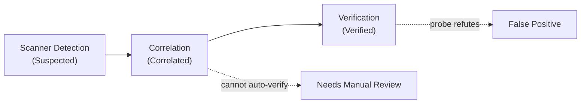

# 10 — Verification Model

## 10.1 The Three Levels

WATCHTOWER treats a tool signal, a correlation, and a verification as three distinct
epistemic states. Conflating them is the exact failure mode this project exists to avoid.

| Level | Question it answers | Confidence | Status |
|-------|---------------------|-----------|--------|
| **Scanner Detection** | "Does a tool's rule match here?" | low | `suspected` |
| **Correlation** | "Do independent sources point at the same asset/issue?" | medium | `correlated` |
| **Verification** | "Does the actual security property hold when exercised?" | high | `verified` |

**Correlation ≠ verification.** Correlation increases confidence and priority. Only a
controlled probe that exercises the real behaviour produces `verified`.

## 10.2 Rules Of Verification

1. **Controlled** — probes are bounded and scripted; no fuzzing storms, no destructive
   payloads.
2. **Local-first** — verification targets the locally running World Monitor instance
   (`http://localhost:3000`) and infrastructure we own.
3. **Non-destructive** — no data deletion, no state corruption, no denial-of-service.
4. **Evidence-producing** — every verdict writes an artefact (request/response, canary
   log) to the evidence store.
5. **Fail-safe** — if a probe cannot run safely or its result is ambiguous, the finding
   becomes `needs_manual_review`, never a silent pass or fail.

## 10.3 Worked Examples

Each example follows Detection → Correlation → Verification. **None of these asserts that
World Monitor has the issue** — they describe how WATCHTOWER *would decide*, and each
includes the outcome that would instead mark a **False Positive**.

### 10.3.1 SSRF

- **Detection.** Semgrep flags an outbound `fetch()` to a request-influenced URL in a
  handler (e.g. a proxy/relay route).
- **Correlation.** The flagged file maps to a live route observed by ZAP/discovery at the
  same path → `correlated`.
- **Verification.** WATCHTOWER starts a **local canary HTTP server** it controls and
  drives the target to fetch a canary URL. If the canary receives the server-side
  request → **Verified SSRF**. If the request is blocked by an allowlist / private-IP
  rejection, or never arrives → **False Positive** (or `needs_manual_review` if
  inconclusive).
- **Boundary:** the canary is always local/owned. WATCHTOWER **never** probes cloud
  metadata endpoints (e.g. link-local addresses) or unrelated third-party hosts.

### 10.3.2 CORS

- **Detection.** A probe/scanner reports `Access-Control-Allow-Origin: *` or a reflected
  `Origin` on an API route.
- **Correlation.** The route is cross-referenced with whether it returns
  authenticated/credentialed data or is a public read-only endpoint.
- **Verification.** WATCHTOWER replays the request with a crafted foreign `Origin` and
  inspects the response: is the origin reflected **and** are credentials allowed
  (`Access-Control-Allow-Credentials: true`) on a sensitive response? Only a combination
  that actually exposes protected data cross-origin → **Verified**. A wildcard on a
  deliberately public, unauthenticated, read-only endpoint is recorded as **by-design /
  False Positive** — wildcard CORS alone is not a vulnerability.

### 10.3.3 Authentication / Programmatic Access

- **Detection.** Discovery finds an API/MCP route; a rule suggests it may lack auth.
- **Correlation.** The route is matched against the documented auth model (which paths
  require a key, which are intentionally public).
- **Verification.** WATCHTOWER sends an **unauthenticated** request (no API key, no
  session) and records exactly what is returned: `401/403` (control holds), a documented
  public payload (by design), or protected data (a real finding). The **evidence is the
  actual response**; the verdict is what was demonstrably accessible without credentials.

### 10.3.4 Security Headers / CSP

- **Detection.** A passive scan reports a missing/weak header or a permissive CSP
  directive on a response.
- **Correlation.** The observed runtime header is compared against the configured policy
  (`vercel.json` header rules, the `index.html` meta CSP, and the desktop
  `tauri.conf.json` CSP) to see whether runtime matches intended config.
- **Verification.** WATCHTOWER re-fetches the specific route and confirms the header's
  presence/value at runtime. A directive that is *intended* to be permissive for a
  documented reason (e.g. an embeddable widget route) is annotated accordingly rather
  than scored as a weakness. The verdict is grounded in the observed response header, not
  the scanner's generic expectation.

### 10.3.5 Rate Limiting

- **Detection.** A rule or the app's own policy indicates an endpoint should be
  rate-limited.
- **Correlation.** The endpoint is matched against the rate-limit configuration
  (Upstash sliding-window usage, per-endpoint overrides).
- **Verification.** WATCHTOWER issues a **controlled, bounded burst** (a small fixed
  number of requests, not a flood) and checks for `429`/limit headers. Enforcement
  observed → control holds. No throttling on a route expected to have it →
  finding. The burst is intentionally tiny so the probe is non-destructive and not a DoS.

## 10.4 What Verification Never Does

- It never runs destructive or denial-of-service payloads.
- It never targets third-party or cloud-metadata infrastructure.
- It never promotes a finding to `verified` from correlation alone.
- It never discards a finding it could not test — that becomes `needs_manual_review`.

See [07-security-assessment-methodology.md](07-security-assessment-methodology.md) for how
verification sits inside the full assessment phases, and
[08-finding-schema.md](08-finding-schema.md) for the `verification` object it writes.

